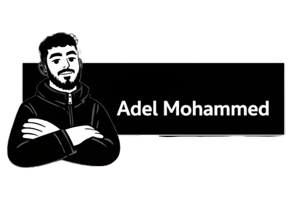

<p align="center">
  
</p>

<h1 align="center">Hi 👋 I'm Adel</h1>
<p align="center">
  Full Stack Developer • React • Node.js • Firebase <br/>
  I build full-stack web applications — from clean, responsive UIs to scalable backend systems.
</p>


### 🚀 Currently Working On
- Full-stack blog platform (React + Firebase)
- Admin dashboards & CMS systems
- Performance optimization & clean architecture


### 🛠 Tech Stack
```js
const adel = {
  frontend: ["React", "HTML", "CSS", "JavaScript"],
  backend: ["Node.js", "Firebase", "REST APIs"],
  database: ["MongoDB", "Firestore"],
  tools: ["Git", "GitHub", "VS Code"],
  learning: ["System Design", "Advanced Backend"]
};
